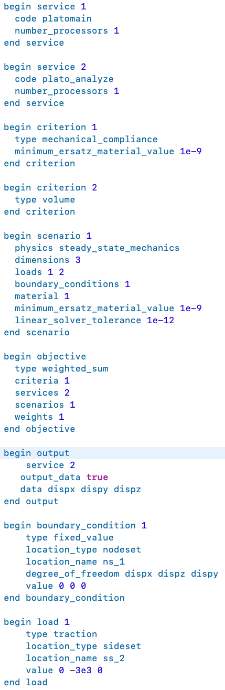

.. _input_deck_intro_sec:

Introduction
############

This document describes the Morphorm software input deck. The input deck contains the “recipe” for running an optimization-based digital design engineerign workflow. There is a plethora of methods one can explore with Morphorm. For instance, Morph enables the application of topological or parametric shape/CAD optimization methods. In these class of problems, a person is trying to optimize the geometry such that the resulting design meets a set of performance, manufacturing, and reliability criteria. These types of problems require a geometric definition of the design domain as well as instructions about the design goals. The design goals are defined by objectives and constraints, physics used to evaluate the design goals, optimization algorithm use to find the optimal design, and variuos other parameters. The geoemtry is generally provided in the form of a STEP file or a finite element mesh. Additional instructions are contained in the input deck. This document will define the general concepts used for the setup of a Morphorm optimization-based digital design engineering workflow and will then define all the possible options that can be included in the input deck to inform the digital design engineering problem.

.. _input_deck_general_concepts_sec:

General Concepts
################

Optimization-based digital design engineering problems can be very complex and require lots of different inputs. The Morphorm input deck is designed to be very general in the way it defines an optimization problem. The input deck breaks the optimization-based digital design engineering problem into fundamental pieces that can be combined to define a design workflow. There are five main building blocks upon which all optimization-based digital design engineering workflows are defined in the Morphorm design ecosystem. This section will briefly introduce these building blocks and describe how they are used to define a trade study.

.. _input_deck_service_subsec:

Service
*******

:ref:`Services <input_deck_service_subsec>` are the software executables that will be performing the work define by a Morphorm digital design engineering workflow. A typical run always uses at least two different services. There will be a Morphorm service that contains the optimizer, Morphorm Optimize. In addition, there will typically be one or more analysis services which will simulate the physics of interests and evaluate physics-based performance criteria defining the objectives and constraints for the problem. The services are defined independently in the input deck so that they can be defined once and then referenced by other items in the input deck that need to use them.

.. _input_deck_criterion_subsec:

Criterion
*********

A criterion is a quantity of interest that will be calculated to evaluate the performance of a design, or set of designs, at a given optimization iteration. For example, if my objective in a topology optimization problem was to minimize the compliance of a structure (make it stiffer) the criterion would be some measure of the compliance of the structure. If my objective was to match a set of user-supplied mass properties, my criterion would be the mismatch between the current iteration’s mass properties and those provided by the user. Criteria are also used in constraints. If I have a volume constraint as part of my topology optimization problem, the criterion for that constraint would be the volume. In the input deck, criteria are defined independently of the objectives and constraints so that they can be defined only once and then referenced repeatedly as needed by different objectives or constraints.

.. _input_deck_scenario_subsec:

Scenario
********

A scenario is a description of the physics being simulated to permit the evaluation of the performance criteria. It includes the type of physics being simulated as well as the loads and boundary conditions describing the physical problem. Morphorm supports problems with multiple objectives, multiple constraints, multiple physics, multiple load cases, etc. This makes the Morphorm software stack ideal for performing design trade studies over multiple physical environments. Scenarios provide a general way for defining these types of design trade studies. As with services and criteria, scenarios are defined independently in the input deck so that they can be defined once and then referenced by other items if needed.

.. _input_deck_objective_subsec:

Objective
*********

An objective defines what is trying to be achieved in the design trade study. It is made up of the criterion being measured, the service providing the evaluation, and the physical scenario under which the objective value is being considered. The input deck only defines one objective, but the objective can be made up of multiple sub-objectives–each with its own criterion, service, and scenario. The sub-objectives can be weighted based on their importance in the problem.

.. _input_deck_constraint_subsec:

Constraint
**********

A constraint defines limitations on quantities of interest in the optimization problem. For example, in a stress-constrained mass minimization problem the user defines a maximum stress that any point in the design can experience. In a compliance minimization problem the user will typically put a constraint on the volume or mass of the final design. Similar to an objective, a constraint is made up of the criterion being measured, the service providing the evaluation, and the physical scenario under which the constraint value is being measured.

.. _input_deck_method_subsec:

Method
******

The method block specifies which method will be employed in the study and associated method options. For example, in a multi dimensional parameter study, the 
user will define the number of parameters and associated number of intervals per variable. In addition, the lower and upper bounds for each parameter under 
study are also specified. At least one method block is required. However, multiple method blocks may appear in the input deck for advanced design trade studies.

.. _input_deck_options_sec:

Input Deck Options
##################

This section will define all of the possible entries in the input deck and their corresponding syntax.

.. _input_deck_syntax_subsec:

Syntax
******

The input deck is organized into different groupings of commands called blocks. The main block types in the input deck are: criterion, scenario, service, objective, constraint, method) were described in the :ref:`General Concepts <input_deck_general_concepts_sec>` section. Each block will contain one or more lines containing keyword/value pairs. For example, “loads 1 5 6” is a keyword value pair where the keyword is “loads” and the value is made up of the 3 load ids “1 5 6”. :numref:`DescriptionOfValueTypes` shows the different types of values and a description of each.

.. _DescriptionOfValueTypes:

.. csv-table:: Description of Value Types
   :header: "Value Type", "Description"
   :widths: 5, 20
   :align: center

   "Boolean", "Data that can only take on the value true or false."
   "integer", "Data that can only take on integer values. Example: 4 10 50."
   "value", "Data that can only take on real or floating point values. Example: 4.33."
   "string", "Data that can only take on string values. Example: stress."
   
For each input deck parameter described in the following sections we use a variation of the syntax “parameter {integer}” to show the syntax for that parameter. Here are some examples:

   * **number processors {integer}**: Indicates that the user should enter a single integer value for this parameter–“number processors 16”.
   * **loads {integer}{...}**: Indicates that the user should specify one or more integer values for this parameter separated by spaces–“loads 1 2 3”.
   * **output_data {Boolean}**: Indicates that the user should specify “true” or “false” for this parameter–“output_data true”.
   * **type {string}**: Indicates that the user should specify a string for this parameter– “type volume”.
   * **load case weights {value}{...}**: Indicates that the user should specify one or more real values–“load case weights 0.1 0.4 0.5”.

Comments within an input deck can be specified as lines beginning with “//”. For that line, all symbols after the “//” will be ignored by the input deck parsing. :numref:`InputDeckExample` shows a simple Morphorm input deck example.

.. _InputDeckExample:

   
   Example of a Morphorm input deck

.. _input_deck_options_service_subsec:

Service
*******

This section shows how to define a service block. Each service block begins and ends with the tokens “begin service {string}” and “end service”, respectively. The string following “begin service” specifies an identifier for this service. Other blocks in the input deck will use this identifier to reference the service block. The following is a typical service block definition:

.. code-block:: console
   
   begin service 1
      code engine
      number_processors 16
   end service
   
The Morphorm input deck can contain one or more service blocks and the first serivce of every input deck must 
be a service with “code engine”. The first service has the methods use to perform the trade studies. The 
:ref:`engine <introduction_github_repos_sec>` service is also responsible for orchestrating the execution 
of the digital design engineering studies. The Morphorm input deck templates from which new Morphorm problems 
are defined will always have the first service defined as the :ref:`engine <introduction_github_repos_sec>` 
service. The following tokens can be specified in any order within the service block.

.. _input_deck_options_service_code_kw:

code
====

Each service **MUST** specify the code (software executable) that will be providing the service in the format: 
“code {string}”. Current options include :ref:`engine <introduction_github_repos_sec>` and :ref:`analyze <introduction_github_repos_sec>`.

.. _input_deck_options_service_numproc_kw:

number_processors
=================

Each service **MUST** specify the number of processors the service will be run on using the format: “number_processors {integer}”. For GPU jobs, Analyze only supports execution 
on one processor. Support for multi-GPU acceleration is under development. 

.. _input_deck_options_service_dids_kw:

device_ids
==========

When running on GPUs with Analyze you can specify which GPU (device) to use if the machine you are running on has multiple GPUs. 
This is done using the format: “device_ids {integer}{...}”. Typically, you will only specify one device id.

.. _input_deck_options_service_cache_kw:

cache_state
===========

Each service can specify whether it uses the “cache_state” mechanism during an optimization run. This is done using the format: “cache_state {Boolean}”. 
For efficiency services can utilize a caching mechanism that reduces the need for recomputing state variables if it has been already computed. Analyze 
already caches the state accordingly. This feature is available in the case the user decides to integrate a non-Morphorm simulation code into the Morphorm ecosystem. 

.. _input_deck_options_service_update_kw:

update_problem
==============

Each service can specify whether it uses the “update_problem” mechanism during an optimization run. This is done using the format: “update_problem {Boolean}”. 
Some optimization problems (such as stress-constrained mass minimization) require the physics code to update local state information at certain frequencies. 
The “update_problem” flag specifies whether the optimizer will call the update operation for this service. Analyze already applies the update problem feature 
accordingly. This feature is available in the case the user decides to integrate a non-Morphorm simulation code into the Morphorm ecosystem.

.. _input_deck_options_criterion_subsec:

Criterion
*********

This section shows how to define a criterion block. Each criterion block begins and ends with the tokens “begin criterion {integer}” and “end criterion”, 
respectively. The string following “begin criterion” specifies an identifier for this criterion. Other blocks in the input deck will use this identifier 
to reference the criterion. The following is a typical criterion block definition:

.. code-block:: console
   
   begin criterion 1
      type mechanical_compliance
   end criterion

The Morphorm input deck can contain an arbitrary number of criterion blocks. The following tokens can be specified in any order within the criterion block.

.. _input_deck_options_criterion_general_kws:

General Parameters
==================

The following general parameters are used to define a Morphorm criterion. 

.. _input_deck_options_criterion_general_type_kw:

type
----

Each criterion **MUST** have a type specified in the format: “type {string}”. :numref:`DescriptionOfCriterionTypes` lists a description of the allowable types and what physics code they can be used with.

.. _DescriptionOfCriterionTypes:

.. csv-table:: Description of supported criterion types
   :header: "Criterion Type", "Description"
   :widths: 10, 30
   :align: center

   "composite", "A criterion that is a combination of multiple sub-criteria. This criterion type is only used when you need a single Analyze performer to evaluate and combine multiple sub-criteria as a weighted sum before returning the aggregated value to the Engine. For the composite criterion to be valid, all of the sub-criteria must use the same :ref:`Scenario <input_deck_scenario_subsec>` definition. A composite criterion includes the ids and weights of the sub-criteria that make it up."
   "displacement", "A measure of the displacement in a given direction. This criterion can be used to constrain the displacement to be a given value"
   "mass properties", "A measure of the mismatch between userspecified mass properties and those of the current design. Minimizing this mismatch will force the optimized design to have the same mass properties as those specified by the user."
   "mechanical_compliance", "A measure of the stiffness of the structure. Minimizing this measure will make the structure stiffer."
   "thermal_compliance", "A measure of the resistance to heat conduction. Minimizing this will maximize heat conduction."
   "stress_and_mass", "Used for doing stress-constrained mass minimization problems."
   "stress_p-norm", "Superscript p used to compute the norm of the stress."
   "volume", "The volume of the current design."
   "mass", "The mass of the current design."
   "flux_p-norm", "Superscript p used to compute the norm of the heat flux."

.. _input_deck_options_criterion_general_ids_kw:

criterion_ids
-------------

When defining a composite criterion this parameter defines the criterion that make up the composite criterion. The syntax for this paramter 
is: “criterion ids {integer}{...}”. The integer values are the ids of criteria making up the composite criterion.

.. _input_deck_options_criterion_general_weights_kw:

criterion_weights
-----------------

When defining a composite criterion this parameter defines the weights of each criterion that make up the composite criterion. 
The syntax for this paramter is: “criterion weights {value}{...}”.

.. _input_deck_options_criterion_disp_kws:

Criterion Parameters Related to the Displacement Criterion
==========================================================

The displacement at a specific location on the design can be constrained using this type of
criterion. The location is currently defined using a sideset in the mesh and is specified with
respect to a direction. The criterion measures the amount of displacement in that direction
and the criterion can be used in a constraint to constrain what the displacement should be
at that location. This must be done using the “absolute_target” keyword in the constraint block 
rather than “relative_target”. Here is an example displacement criterion followed by a description 
of the different parameters:

.. code-block:: console

   begin criterion 4
     type displacement
     displacement_direction 0 1 0
     measure_magnitude true
     location_type sideset
     location_name ss4
   end criterion

The allowable parameters that define the **"displacement"** criterion are listed next.

.. _input_deck_options_criterion_disp_dir_kw:

displacement_direction
----------------------

This is the direction in which the displacement will be measured. Syntax: “displacement_direction {value} {value} {value}”. 
The 3 values are the three coordinates of the direction.

.. _input_deck_options_criterion_disp_mag_kw:

measure_magnitude
-----------------

This specifies whether to return a signed displacement or not. Syntax: "measure_magnitude {Boolean}". 
If “true” is specified the returned value will be the absolulte value of the displacement. If “false” 
is specified the signed displacement will be returned

.. _input_deck_options_criterion_disp_ltype_kw:

location_type
-------------

This specifies the type of location (sideset or nodeset). Syntax: "location_type {string}". Currently, 
only sideset can be specified for this parameter.

.. _input_deck_options_criterion_disp_lname_kw:

location_name
-------------

This specifies the name of the location sideset or nodeset (only sidesets are allowed at this time). 
Syntax: "location_name {string}".

.. _input_deck_options_criterion_mmprop_kws:

Criterion Parameters Related to Matching Mass Properties
========================================================

The **"mass_properties"** criterion type attempts to generate a design that has matching mass properties. 
This can be done either by using this criterion in a constraint or as part of the objective. When using 
it in the objective the user may need to modify the “weight” parameter in the objective to strengthen 
or weaken the enforcement of the mass property matching. If used as a constraint in a problem that
already has a constraint you should use the mma optimization algorithm which handles multiple constraints 
in a single problem. The following is a typical criterion block specifying mass properties to be matched:

.. code-block:: console

   begin criterion 3
     type mass_properties
     cgx 0.5 weight 1.0
     cgy 0.75 weight 1.5
   end criterion

The allowable parameters that define the **"mass_properties"** criterion are listed next.  

.. _input_deck_options_criterion_mmprop_cgx_kw:

cgx
---

This is the X component of the center of gravity. Syntax: "cgx {value} weight {value}". 
The value is the value you want the final design to have. The weight can be used to 
weight different mass properties differently when multiple are specified.

.. _input_deck_options_criterion_mmprop_cgy_kw:

cgy
---

This is the Y component of the center of gravity. Syntax: “cgy {value}
weight {value}”. The value is the value you want the final design to have. The weight can
be used to weight different mass properties differently when multiple are specified.

.. _input_deck_options_criterion_mmprop_cgz_kw:

cgz
---

This is the Z component of the center of gravity. Syntax: “cgz {value} weight {value}”. 
The value is the value you want the final design to have. The weight can be used to 
weight different mass properties differently when multiple are specified.

.. _input_deck_options_criterion_mmprop_ixx_kw:

ixx 
---

This is the mass moment of inertia about the X axis. Syntax: “ixx {value}
weight {value}”. The value is the value you want the final design to have. The weight can
be used to weight different mass properties differently when multiple are specified.

.. _input_deck_options_criterion_mmprop_iyy_kw:

iyy
---

This is the mass moment of inertia about the Y axis. Syntax: “iyy {value}
weight {value}”. The value is the value you want the final design to have. The weight can
be used to weight different mass properties differently when multiple are specified.

.. _input_deck_options_criterion_mmprop_izz_kw:

izz
---

This is the mass moment of inertia about the Z axis. Syntax: “izz {value}
weight {value}”. The value is the value you want the final design to have. The weight can
be used to weight different mass properties differently when multiple are specified.

.. _input_deck_options_criterion_mmprop_ixy_kw:

ixy
---

This is the XY product of inertia. Syntax: “ixy {value} weight {value}”. The value is 
the value you want the final design to have. The weight can be used to weight different 
mass properties differently when multiple are specified.

.. _input_deck_options_criterion_mmprop_iyz_kw:

iyz
---

This is the YZ product of inertia. Syntax: “iyz {value} weight {value}”. The value is 
the value you want the final design to have. The weight can be used to weight different 
mass properties differently when multiple are specified.

.. _input_deck_options_criterion_mmprop_ixz_kw:

ixz
---

This is the XZ product of inertia. Syntax: “ixz {value} weight {value}”. The value is 
the value you want the final design to have. The weight can be used to weight different 
mass properties differently when multiple are specified.

.. _input_deck_options_criterion_scmm_kws:

Stress-Constrained Mass Minimization Problems
=============================================

The stress-constrained mass minimization problem formulation, criterion type **stress_and_mass**, applies an augmented Lagrangian (AL) 
formulation to enforce the stress constraints in each element. As such, there are various AL parameters that can be set as part of the 
**“stress_and_mass”** criterion. This section describes these parameters.

.. _input_deck_options_criterion_scmm_slimit_kw:

stress_limit 
------------

The value of the of the local stress measure under which the optimizer should try to constrain all points in the design. Syntax: “stress_limit {value}”.

.. _input_deck_options_criterion_scmm_ipenalty_kw:

scmm_initial_penalty 
--------------------

The initial value of the penalization scalar used to enforce the local stress constraint. Syntax: “scmm_initial_penalty {value}”.

.. _input_deck_options_criterion_scmm_expansion_kw:

scmm_penalty_expansion_multiplier
---------------------------------

The amount to “grow” the stress constraint penalty by each time it is updated. The update mechanism is controlled by the 
:ref:`update_problem <input_deck_options_service_cache_kw>` feature. Syntax: “scmm_penalty_expansion_multiplier {value}”.

.. _input_deck_options_criterion_scmm_cexponent_kw:

scmm_constraint_exponent 
------------------------

The power that the stress constraint term in the formulation will be raised to. Syntax: “scmm_constraint_exponent {value}”. A typical value is 2 or 3.

.. _input_deck_options_criterion_scmm_pub_kw:

scmm_penalty_upper_bound 
------------------------

The maximum value the stress constraint penalty can grow to. Syntax: “scmm_penalty_upper_bound {value}”.

.. _input_deck_options_scenario_subsec:

Scenario
********

This section shows how to define a scenario block. Each scenario block begins and ends with the tokens “begin scenario {integer}” 
and “end scenario”, respectively. The string following “begin scenario” denotes an identifier for this scenario. Other 
blocks in the input deck will use the identifier to reference the scenario. The following is a typical scenario block definition:

.. code-block:: console
   
   begin scenario 1
      physics steady_state_mechanics
      dimensions 3
      loads 1 2
      boundary_conditions 5
      material 1
      minimum_ersatz_material_value 1e-3
   end scenario

The Morphorm input deck can contain an arbitrary number of scenario blocks. The following tokens can be specified in any order 
within the scenario block.

.. _input_deck_options_scenario_physics_kw:

physics
=======

Each scenario **MUST** define the physics used to simulate and evaluate the performance criteria in the format: “physics {string}”. 
:numref:`DescriptionOfAvailablePhysics` lists the supported physics and provides a brief description.

.. _DescriptionOfAvailablePhysics:

.. csv-table:: Description of available physics
   :header: "Physics", "Description"
   :widths: 15, 25
   :align: center

   "steady_state_mechanics", "Steady state linear elastic solution"
   "steady_state_thermal", "Steady state heat conduction"
   "steady_state_thermomechanics", "Steady state thermo-mechanical solution"
   "steady_state_incompressible_fluids", "Steady state laminar-incompressible flow solution"
   "thermoplasticity", "Steady state thermo-plasticity solution using a J2 plasticiy model"

.. _input_deck_options_scenario_dims_kw:

dimensions
==========

Within each scenario the user **MUST** specify the dimensions of the problem in the format: “dimensions {integer}”. Possible values are 2 and 3.

.. _input_deck_options_scenario_loads_kw:

loads
=====

Within each scenario the user **MAY** specify its relevant loads in the format: “loads {integer}{...}”. 
The integer values are the ids of the load blocks defined in the input deck.

.. _input_deck_options_scenario_bcs_kw:

boundary_conditions
===================

Within each scenario the user **MUST** specify its relevant boundary conditions in the format: “boundary_conditions {integer}{...}”. 
The integer values are the ids of boundary condition blocks defined in the input deck.

.. _input_deck_options_scenario_minersatz_kw:

minimum_ersatz_material_value
=============================

Within each scenario the user **MAY** specify the minimum density value that can exist in the 
design using the format: “minimum ersatz material value {value}”. This parameter is only applicable 
when solving density-based topology optimization problems. 

.. _input_deck_options_scenario_tol_kw:

tolerance
=========

Within each scenario the user **MAY** specify the tolerance for the linear solver used to solve the 
linear system of equations using  the format: “tolerance {value}”.

.. _input_deck_options_scenario_pmodel_kw:

material_penalty_model
======================

Within each scenario the user **MAY** specify the material penalty model to be used in density-based 
topology optimization problems using the format: “material penalty model {string}”. Valid models are 
“simp” and “ramp”. The default value is “simp”.

.. _input_deck_options_scenario_pexp_kw:

material_penalty_exponent
=========================

Within each scenario the user **MAY** specify the material penalty exponent to be used in density-based 
topology optimization problems using the format: “material penalty exponent {value}”. The default value is 3.0.

.. _input_deck_options_objective_subsec:

Objective
*********

This section shows how to define an objective block. Each input deck contains only one objective block. However, 
the objective can be made up of one or more sub-objectives. The objective block begins and ends with the tokens 
“begin objective” and “end objective”, respectively. The following is a typical objective block definition:

.. code-block:: console
   
   begin objective
      type weighted_sum
      services 2 3
      criteria 3 4
      scenarios 1 2
      weights 1.0 0.75
   end objective

The example objective above is made up of two sub-objectives. The first sub-objective uses service 2, criterion 3, 
scenario 1, and is weighted with a value of 1.0. The second sub-objective uses service 3, criterion 4, scenario 2, 
and is weighted with a value of 0.75. The services, criteria, and scenarios are defined elsewhere in the input deck 
and referenced in the objective by their id. In this example, to evaluate the objective the sub-objectives are 
evaluated, scaled by their corresponding weights, and then summed. The following tokens can be specified in any 
order within the objective block.

.. _input_deck_options_objective_type_kw:

type
====

Each objective **MUST** specify its type using the format: “type {string}”. Valid types are “single_criterion” and “weighted_sum”.

.. _input_deck_options_objective_services_kw:

services
========

Each objective **MUST** specify the services used by the sub-objectives using the format: “services {integer}{...}”. 
There must be one service specified for each sub-objective.

.. _input_deck_options_objective_criteria_kw:

criteria
========

Each objective **MUST** specify the criteria used by the sub-objectives using the format: “criteria {integer}{...}”. 
There must be one criterion specified for each sub-objective.

.. _input_deck_options_objective_scenarios_kw:

scenarios
=========

Each objective **MUST** specify the scenarios used by the sub-objectives using the format: “scenarios {integer}{...}”. 
There must be one scenario specified for each sub-objective.

.. _input_deck_options_objective_weights_kw:

weights
=======

Each objective **MAY** specify the weights used by the sub-objectives if it is a “weighted_sum” type objective. 
This is done using the format: “weights {value}{...}”. There must be one weight specified for each sub-objective. 
Weights need not sum to 1.0.

.. _input_deck_options_objective_shapeserv_kw:

shape_services
==============

Additional services are required for parametric shape optimization problems to provide the CAD parameter shape 
sensitivities needed by a gradient-based optimizer. These services are specifed using the format: “shape_services 
{integer}{...}”. There must be one shape service specified for each sub-objective.

.. _input_deck_options_objective_multiload_kw:

multi_load_case
===============

There is an option in Analyze to have a single :ref:`analyze <introduction_github_repos_sec>` service calculate 
the sub-objectives associated with multiple load cases in sequence rather than requiring multiple 
:ref:`analyze <introduction_github_repos_sec>` services. This would typically be done when you are resource-limited 
and can’t afford to run multiple instances of :ref:`analyze <introduction_github_repos_sec>` – one for each load 
case. In this case you would specify “multi_load_case true” in the objective block and set all of your sub-objective 
service ids to be the single :ref:`analyze <introduction_github_repos_sec>` service that will be running the 
different load cases in sequence. When the :ref:`engine <introduction_github_repos_sec>` asks for the objective 
evaluation at each iteration the :ref:`analyze <introduction_github_repos_sec>` service will calculate each of 
the sub-objectives corresponding to the different load cases sequentially, create a weighted sum of the 
sub-objectives using the weights specified in the objective block, and then return a single objective value to 
the :ref:`engine <introduction_github_repos_sec>`.

.. _input_deck_options_constraint_subsec:

Constraint
**********

This section shows how to define a constraint block. The user is currently allowed to specify one contraint in 
the input deck. The multi-constraint definition will be enabled in the next release. The constraint block begins 
and ends with the tokens “begin constraint {integer}” and “end constraint”, respectively. The string following 
“begin constraint” will eventually be used to support multiple constraints in a single design study. The following 
is a typical constraint block definition:

.. code-block:: console
   
   begin constraint 1
      service 1
      criterion 3
      scenario 1
      relative_target 0.5
   end constraint

The following tokens can be specified in any order within the constraint block.

.. _input_deck_options_constraint_service_kw:

service
=======

Each constraint **MUST** specify a service in the format: “service {integer}”. This service will calculate the constraint value.

.. _input_deck_options_constraint_criterion_kw:

criterion
=========

Each constraint **MUST** specify a criterion in the format: “criterion {integer}”. This is the criterion 
that will be evaluated in order to determine how well the constraint is being met. For example, in 
the example constraint above criterion 3 could be a volume criterion in which case service 1 would 
calculate the volume and then this value would be used to determine how well the relative constraint 
target of 0.5 was met.

.. _input_deck_options_constraint_scenario_kw:

scenario
========

Each constraint **MUST** specify a scenario in the format: “scenario {integer}”. The scenario defines 
the physics conditions under which the constraint is evaluated.

.. _input_deck_options_constraint_rtarget_kw:

relative_target
===============

Each constraint can specify a target value either as a relative target or an absolute target. For 
relative targets the syntax is: “relative_target {value}”. Currently, the only constraints that 
uses a relative target value for are the mass and volume constraints. In this case, the user 
specifies a target relative to the starting volume of the design domain. In the example constraint 
above the relative target of 0.5 would mean we want the final design to use 50% of the original 
design domain as our volume budget.

.. _input_deck_options_constraint_atarget_kw:

absolute_target
===============

Each constraint can specify a target value either as a relative target or an absolute target. For 
absolute targets the syntax is: “absolute_target {value}”. An example of a constraint with an absolute 
target would be a volume constraint where you are specifying an abosolute volume value that your final 
design must adhere to.

.. _input_deck_options_load_subsec:

Load
****

This section shows how to define a load block. Each load block begins and ends with the tokens “begin 
load {integer}” and “end load”, respectively. The integer following “begin load” specifies the 
identification index of this load. Other blocks in the input deck will use this value to reference the 
load. The following is a typical load block definition:

.. code-block:: console
   
   begin load 1
      type traction
      location_type sideset
      location_name ss_1
      value 0 -3e3 0
   end load

The following tokens can be specified in any order within the load block.

.. _input_deck_options_load_type_kw:

type
====

Each load **MUST** specify the type using the format: “type {string}”. Current options include “traction”, 
“uniform surface flux”, and “pressure”. :numref:`DescriptionOfSupportedLoadTypes` lists a description 
of the allowable types of loads.

.. _DescriptionOfSupportedLoadTypes:

.. csv-table:: Description of supported load types
   :header: "Load Type", "Description"
   :widths: 10, 30
   :align: center

   "traction", "Arbitray direction traction load on a surface. Specify traction component values separated by spaces (e.g. 0.2 2e-3 200 in three dimensions)."
   "pressure", "Surface load normal to the surface. Specified by a single scalar value."
   "uniform_surface_flux", "Thermal surface load. Single value specifying the normal flux to the surface."

.. _input_deck_options_load_ltype_kw:

location_type
=============

Each load **MUST** specify the application location type using the format: “location_type {string}”. Current 
options include “sideset” and “nodeset”..

.. _input_deck_options_load_lname_kw:

location_name
=============

Each load **MUST** specify an application location by providing the name of the entity set where the load is applied. 
The syntax for specifying by name is:“location_name {string}”.

.. _input_deck_options_load_value_kw:

value
=====

Each load **MUST** specify a value using the syntax:“value {value}{...}”. Depending on the type of load more than one 
value may need to be specified. For example, :ref:`traction <DescriptionOfSupportedLoadTypes>` loads require x, y, 
and z components in three dimensions. Therefore, a :ref:`traction <DescriptionOfSupportedLoadTypes>` load would be 
specified as follows: “value 0 -3e3 0”.

.. _input_deck_options_bcs_subsec:

Boundary Condition
******************

This section shows how to define an essential boundary condition block. Each boundary condition block begins 
and ends with the tokens “begin boundary condition {integer}” and “end boundary condition”, respectively. The 
string following “begin boundary condition” specifies an identifier for this boundary condition. Other blocks 
in the input deck will use this value to reference the boundary condition. The following is a typical boundary 
condition block definition:

.. code-block:: console
   
   begin boundary_condition 1
      type fixed_value
      location_type sideset
      location_name ss_1
      degree_of_freedom temp
      value 0.0
   end boundary_condition

The following tokens can be specified in any order within the boundary condition block.

.. _input_deck_options_bc_type_kw:

type
====

Each boundary condition **MUST** specify the type using the format: “type {string}”. Current options include “fixed value” and “insulated”.

.. _input_deck_options_bc_ltype_kw:

location_type
=============

Each boundary condition **MUST** specify the application location type using the format: “location_type {string}”. 
Current options include “sideset” and “nodeset”.

.. _input_deck_options_bc_lname_kw:

location_name
=============

Each boundary condition **MUST** specify a application location. The syntax for specifying the application location is: 
“location_name {string}”. 

.. _input_deck_options_bc_dof_kw:

degree_of_freedom
=================

Depending on the boundary condition type you **MAY** need to specify a degree of freedom. The syntax is: 
“degree_of_freedom {string}{...}”. Possible values for degrees of freedom are “temp” (temperature), “dispx” 
(displacement in the x direction), “dispy” (displacement in the y direction), and “dispz” (displacement in 
the z direction). Multiple degrees of freedom can be specified in a single “fixed_value” boundary condition 
by listing the degrees of freedom separated by spaces. For example, you can specify a fixed value boundary 
condition for all 3 displacement directions with the following: “degree_of_freedom dispx dispy dispz”. If 
you specify more than one degree of freedom in this way you must also have the same number or corresponding 
values in the “value” line. For this example, the “value” line would need to be: “value 0 0 0” for a fixed 
value of 0.0 in all 3 directions.

.. _input_deck_options_bc_value_kw:

value
=====

Each boundary condition can specify a value using the syntax: “value {value}{...}”.

.. _input_deck_options_block_subsec:

Block
*****

This section shows how to define an element block in the input deck. Each **block** block begins and ends with 
the tokens “begin block {integer}” and “end block”, respectively. The string following “begin block” specifies 
an identifier for this “block”. Other blocks in the input deck will use this value to reference the **block** 
block. The following is a typical **block** definition:

.. code-block:: console
   
   begin block 1
      material 1
      element_type tet4
   end block

The following tokens can be specified in any order within the **block** block.

.. _input_deck_options_block_material_kw:

material
========

Each block **MUST** specify a material using the format: “material {integer}”.

.. _input_deck_options_block_etype_kw:

element_type
============

Each block **MAY** specify the element type using the format: “element type {string}”. 
:numref:`DescriptionOfSupportedElementTypes` lists a description of the allowable element types.

.. _DescriptionOfSupportedElementTypes:

.. csv-table:: Description of supported element types
   :header: "Element Type", "Description"
   :widths: 10, 20
   :align: center

   "tet4", "First-order tet element."
   "hex8", "First-order hex element."
   "tet10", "Second-order tet element."

.. _input_deck_options_material_subsec:

Material
********

This section shows how to define a material block in the input deck. Each material block begins and ends with 
the tokens “begin material {integer}” and “end material”, respectively. The string following “begin material” 
specifies an identifier for this material. Other blocks in the input deck will use this value to reference the 
material. The following is a typical material block definition:

.. code-block:: console
   
   begin material 1
      material_model isotropic_linear_thermal
      thermal_conductivity 210
      mass_density 2703
      specific_heat 900
   end material

The following tokens can be specified in any order within the material block.

.. _input_deck_options_material_model_kw:

material_model
==============

Each material **MUST** specify a material model using the format: “material_model {string}”. 
:numref:`DescriptionOfSupportedMaterialModels` lists the allowable material models.

.. _DescriptionOfSupportedMaterialModels:

.. csv-table:: Description of supported element types
   :header: "Material Model", "Description"
   :widths: 13, 30
   :align: center

   "isotropic_linear_elastic", "`Isotropic linear elastic material <https://en.wikipedia.org/wiki/Linear_elasticity#(An)isotropic_(in)homogeneous_media>`_"
   "orthotropic_linear_elastic", "`Orthotropic linear elastic material <https://en.wikipedia.org/wiki/Orthotropic_material>`_"
   "isotropic_linear_thermal", "Assumes homogeneous `thermal conductivity <https://en.wikipedia.org/wiki/Thermal_conductivity>`_ in the body"
   "isotropic_linear_thermoelastic", "Assumes homogeneous thermal and mechanical material properties in the body"

 
.. _input_deck_options_material_isoelastic_kws:

Isotropic Linear Elastic Properties
===================================

The following tokens **MUST** be defined if the "material_model" keyword is set to "isotropic_linear_elastic".

.. _input_deck_options_material_isoelastic_youngs_kw:

youngs_modulus
--------------

The `Young's modulus <https://en.wikipedia.org/wiki/Young%27s_modulus>`_ is a mechanical property that measures 
the tensile or compressive stiffness of a solid material. Syntax: “youngs_modulus {value}”.

.. _input_deck_options_material_isoelastic_poisson_kw:

poissons_ratio
-------------- 

The `Poisson's ration <https://en.wikipedia.org/wiki/Poisson%27s_ratio>`_ measures the deformation (expansion or contraction) 
of a material in directions perpendicular to the specific direction of loading. Syntax: “poissons_ratio {value}”.

.. _input_deck_options_material_isoelastic_density_kw:

mass_density
------------

The `density <https://en.wikipedia.org/wiki/Density>`_ of a material measures its mass per unit volume. 
A density value is only needed when modeling inertial forces (e.g. dynamic problems). Syntax: 
“mass_density {value}”.

.. _input_deck_options_material_orthoelastic_kws:

Orthotropic Linear Elastic Properties
=====================================

The following tokens **MUST** be defined if the "material_model" keyword is set to "orthotropic_linear_elastic".

.. _input_deck_options_material_orthoelastic_ymx_kw:

young_modulus_x
---------------

Mechanical property that measures the tensile or compressive stiffness of a solid material along the X direction.
Syntax: “youngs_modulus_x {value}”.

.. _input_deck_options_material_orthoelastic_ymy_kw:

youngs_modulus_y
----------------

Mechanical property that measures the tensile or compressive stiffness of a solid material along the Y direction. 
Syntax: “youngs_modulus_y {value}”.

.. _input_deck_options_material_orthoelastic_ymz_kw:

youngs_modulus_z
----------------

Mechanical property that measures the tensile or compressive stiffness of a solid material along the Z direction. 
Syntax: “youngs modulus z {value}”.

.. _input_deck_options_material_orthoelastic_pxy_kw:

poissons_ratio_xy
-----------------

Measures the contraction in direction Y when an extension is applied in direction X. 
Syntax: “poissons_ratio_xy {value}”.

.. _input_deck_options_material_orthoelastic_pxz_kw:

poissons_ratio_xz 
-----------------

Measures the contraction in direction Z when an extension is applied in direction X. 
Syntax: “poissons_ratio_xz {value}”.

.. _input_deck_options_material_orthoelastic_pyz_kw:

poissons_ratio_yz
-----------------

Measures the contraction in direction Z when an extension is applied in direction Y. 
Syntax: “poissons_ratio_yz {value}”.

.. _input_deck_options_material_orthoelastic_smxy_kw:

shear_modulus_xy
----------------

Measures the shear modulus in direction Y on the plane whose normal is in direction X.
Syntax: “shear_modulus_xy {value}”. The `shear modulus <https://en.wikipedia.org/wiki/Shear_modulus>`_ 
measures the elastic shear stiffness of a material and its defined as the ration of the shear stress 
to the shear strain.

.. _input_deck_options_material_orthoelastic_smxz_kw:

shear_modulus_xz
----------------

Measures the shear modulus in direction Z on the plane whose normal is in direction X.
Syntax: “shear_modulus_xz {value}”.

.. _input_deck_options_material_orthoelastic_smyz_kw:

shear_modulus_yz
----------------

Measures the shear modulus in direction Z on the plane whose normal is in direction Y.
Syntax: “shear_modulus_yz {value}”.

.. _input_deck_options_material_orthoelastic_density_kw:

mass_density
------------ 

Measures the mass per unit volume. Syntax: A density value is only when modeling inertial 
forces (e.g. dynamic problems). Syntax: “mass_density {value}”.

.. _input_deck_options_material_isothermal_kws:

Isotropic Linear Thermal Properties
===================================

The following tokens **MUST** be defined if the “material_model” keyword is set to “isotropic_linear_thermal”.

.. _input_deck_options_material_isothermal_conductivity_kw:

thermal_conductivity
--------------------

Measures the ability of a material to conduct heat. Syntax: “thermal_conductivity {value}”.

.. _input_deck_options_material_isothermal_density_kw:

mass_density
------------

Measures the mass per unit volume. A density value is only needed when modeling inertial 
forces (e.g. dynamic problems). Syntax: “mass_density {value}”.

.. _input_deck_options_material_isothermal_sheat_kw:

specific_heat
-------------

The `specific heat capacity <https://en.wikipedia.org/wiki/Specific_heat_capacity>`_ at constant 
pressure is the heat capacity of a sample of the substance divided by the mass of the sample. 
This material property needs to be defined only when modeling the inertial term (e.g. dynamic problems).
Syntax: “specific_heat {value}”.

.. _input_deck_options_material_isothermoelastic_kws:

Isotropic Linear Thermoelastic Properties
=========================================

The following tokens **MUST** be defined if the “material_model” keyword is set to “isotropic_linear_thermoelastic”.

.. _input_deck_options_material_isothermoelastic_conductivity_kw:

thermal_conductivity 
--------------------

See parameter definition :ref:`here <input_deck_options_material_isothermal_conductivity_kw>`. Syntax: “thermal_conductivity {value}”.

.. _input_deck_options_material_isothermoelastic_ym_kw:

youngs_modulus
--------------

See parameter definition :ref:`here <input_deck_options_material_isoelastic_youngs_kw>`. Syntax: “youngs_modulus {value}”.

.. _input_deck_options_material_isothermoelastic_pr_kw:

poissons_ratio 
--------------

See parameter definition :ref:`here <input_deck_options_material_isoelastic_poisson_kw>`. Syntax: “poissons_ratio {value}”.

.. _input_deck_options_material_isothermoelastic_texp_kw:

thermal_expansivity
-------------------

The the coefficient of thermal expansion measures how the size of an object changes with a change in temperature. 
Syntax: “thermal_expansivity {value}”.

.. _input_deck_options_material_isothermoelastic_tempdiff_kw:

temperature_difference
----------------------

The `temperature difference <>_` is a measure of the difference between the surface temperature and the 
quiescent temperature (fluid temperature far from the surface of the object). Syntax: “temperature_difference {value}”.

.. _input_deck_options_material_isothermoelastic_density_kw:

mass_density
------------

See parameter definition :ref:`here <input_deck_options_material_isothermal_density_kw>`. Syntax: “mass_density {value}”.

.. _input_deck_options_method_subsec:

Method
******

This section shows how to define a method block in the input deck. The method block begins and ends with the 
tokens “begin method” and “end “method”, respectively. The following is a typical method block definition for 
a density-based topology optimization problem:

.. code-block:: console
   
   begin method
      optimization_algorithm oc
      discretization density
      initial_density_value 0.5
      filter_radius_scale 1.75
      max_iterations 10
      output_frequency 5
   end method

The following tokens can be specified in any order within the method block.

.. _input_deck_options_method_general_kws:

General Parameters
==================

The following general parameters are used to define a Morphorm method block.

.. _input_deck_options_method_general_opttype_kw:

optimization_type 
-----------------

This parameter specifies the type of optimization approach used for a geometry optimization 
problem. The syntax is: “optimization_type {string}” and valid options are “topology” and “shape”.

.. _input_deck_options_method_general_algo_kw:

optimization_algorithm 
----------------------

This parameter specifies which optimization algorithm will be used to solve the problem. The syntax 
is: “optimization_algorithm {string}”. The current list of supported optimization algoritms are: 

* “oc” - `Optimality Criteria <https://www.tandfonline.com/doi/abs/10.1080/0305215x.2014.914191#:~:text=An%20optimality%20criteria%20(OC)%2D,functions%20satisfy%20certain%20monotonicity%20properties.>`_
* “mma” - `Method of Moving Asymptotes <https://onlinelibrary.wiley.com/doi/abs/10.1002/nme.1620240207>`_
* “umma” - A version of the `Method of Moving Asymptotes <https://onlinelibrary.wiley.com/doi/abs/10.1002/nme.1620240207>`_ algorithm for unconstrained optimization problems
* “ksbc” - `Kelley Sachs Bound Constrained <https://citeseerx.ist.psu.edu/viewdoc/download?doi=10.1.1.57.5451&rep=rep1&type=pdf>`_
* “ksal” - Kelley Sachs Augmented Lagrangian [#]_
* "spgtr" - `Spectral Projected Gradient Trust Region <http://www.optimization-online.org/DB_FILE/2021/01/8231.pdf>`_

.. rubric:: Footnotes

.. [#] The "ksal" algorithm applies the `augmented Lagrangian method <https://en.wikipedia.org/wiki/Augmented_Lagrangian_method>`_ and uses the "ksbc" algorithm to solve the resulting augmented Lagrangian formulation. 

The “oc”, “mma”, "spgtr", and “ksal” algorithms are suited for constrained optimization problems; in 
contrast, the“ksbc” and "umma" algorithms are not. The “oc” algorithm is only applicable for problems 
with a single linear constraint. e.g. compliance minimization in topology optimization. The "spgtr" 
algorithm can only be applied to problems with linear constraints too. However, in contrast to the 
"oc" algorithm, the "spgtr" algorithm can handle multiple linear constraints. If the constraint are 
nonlinear, the "mma" and "ksal" are the algorithms of choice for this class of problems.. 

.. _input_deck_options_method_general_maxitr_kw:

max_iteration
-------------

This parameter specifies how many iterations the algorithm is allowed to take if it doesn’t meet 
a primary stopping criteria first. The following is a list of the primary stopping criteria 

* norm of the gradient is less than some tolerance 
* norm of the search direction is less than some tolerance  
* stagnation in the objective function
* stagnation in the design variables

The syntax is: “max_iterations {integer}”.

.. _input_deck_options_method_general_normalize_kw:

normalize_in_aggregator
-----------------------

This parameter allows the user to specify whether or not the objective values being returned from the 
services will be normalized by the aggregation operation in the engine before they are passed along to 
the optimizer. The syntax is: “normalize_in_aggregator {Boolean}”. The default is for them to be normalized. 
There are a couple of advantages of normalizing. First, the optimizer can perform better when the objective 
value is approximately on the order of 1. Second, when running a problem that has more than one sub-objective, 
the sub-objective values will be of the same order of magnitude, allowing the weights to be specified more 
intuitively.

.. _input_deck_options_method_general_verbose_kw:

verbose
-------

This parameter allows the user to specify whether verbose information will be output to the console during 
an optimization run. The syntax is: “verbose {Boolean}”. If this is set to “true” information about which 
stages and operations are being executed will be outputted to the console.

.. _input_deck_options_method_general_idensityval_kw:

initial_density_value
---------------------

This parameter allows the user to specify the initial density value for a density-based topology optimization 
problem. The syntax is: “initial_density_value {value}”.

.. _input_deck_options_method_output_kws:

Output Parameters
=================

The following parameters are used for output purposes.

.. _input_deck_options_method_output_freq_kw:

output_frequency
----------------

This parameter specifies how often Morphorm will output a design result. The syntax is: “output_frequncy 
{integer}” where the specified integer is how many iterations between design output. Design iterations 
are in the form of an exodus mesh and are written to the run directory. They are usually called 
“Iteration005.exo” where the number in the filename indicates which iteration it came from. 

.. _input_deck_options_method_output_method_kw:

output_method
-------------

This parameter specifies how results in parallel runs will be concatenated to a single file. The syntax 
is: “output_method {string}”. The two valid options are “epu” and “parallel write”. The “epu” option will 
write result files in parallel to disk and then run the epu utility to concatenate the results. The 
“parallel write” option will use a parallel writing capability to write the results to a single concatenated 
result file without the need to run epu afterwards. The reason you might choose one over the other is 
if the performance proves to be better with one option over the other.

.. _input_deck_options_method_fblocks_kws:

Fixed Block Parameters
======================

The following parameters are used to define non-optimizable regions in the design space.
The following list of parameters are useful for topology optimization problems. 

.. _input_deck_options_method_fblocks_ids_kw:

fixed_block_ids
---------------

This parameter allows users to specify "fixed", i.e. frozen, volumes in the design space. In topology 
optimization problems, the optimizer can add or remove material from the design space at every material 
location. In some cases, the designer may want to discourage the optimizer from removing material from 
a certain region due to practical constraints, e.g. a component will be mounted on top of the surface 
of the fixed volume. The "fixed_block_ids" parameter enables the user to specify the `element block 
<https://www.sandia.gov/files/cubit/15.8/help_manual/WebHelp/finite_element_model/exodus/block_specification.htm>`_ 
identifiers associated with the fixed volumes. An element block is a collection of elements grouped into 
a single entity that share common traits such as the element type and material properies. The syntax 
is: “fixed block ids {integer}{...}”.

.. _input_deck_options_method_fsset_ids_kw:

fixed_sideset_ids 
-----------------

This parameter allows the user to specify which sidesets in a topology optimization problem that 
should remain fixed and not “designed” by the optimizer. The syntax is: “fixed_sideset_ids 
{integer}{...}”. The integer values are the ids of the 
`sidesets <https://www.sandia.gov/files/cubit/15.8/help_manual/WebHelp/finite_element_model/exodus/nodesets_and_sidesets.htm>`_ 
that should remain fixed. A sidesets is a group of element sides or faces categorized by their 
owning surfaces or curves or by their individual face IDs.

.. _input_deck_options_method_fnset_ids_kw:

fixed_nodeset_ids
-----------------

This parameter allows the user to specify which mesh nodesets in a topology optimization problem 
that should remain fixed and not “designed” by the optimizer. The syntax is: “fixed_nodeset_ids 
{integer}{...}”. The integer values are the ids of the nodesets that should remain fixed.
A `nodeset <https://www.sandia.gov/files/cubit/15.8/help_manual/WebHelp/finite_element_model/exodus/nodesets_and_sidesets.htm>`_ 
is a group of nodes categorized by their owning volumes, surfaces, curves or vertex.

.. _input_deck_options_method_filter_kws:

Filter Parameters
=================

In density-based topology optimization problems it is often necessary to perform filtering of the 
design variables to avoid numerical instabilities in the results (e.g. checkerboarding). Furthermore, 
the filter helps to ensure an approximate minimum length scale of features in the optimized design. 
While the filter does not completely eliminate the issue of mesh-dependency in many cases, it greatly 
helps alleviate much of the issue. It is always encourage to use a filter if solvign a density-based 
topology optimization problem. The user is recommended to set a filter radius of at least twice the 
size of a typical finite element in the design domain. Morphorm also provides the option to apply 
subsequent projection operations, which helps the optimizer produce a "0-1" design. 

.. _input_deck_options_method_filter_radius_kw:

filter_radius_scale
-------------------

This parameter is used to specify the filter radius as a scaling of the average length of the edges 
in the mesh. The syntax is: “filter_radius_scale {value}” where the scalar value is used to compute 
the filter radius. For example, if the average mesh edge length is 1.5 and the scale factor is 
specified as 2.0, the resulting filter radius will be 3.0.

.. _input_deck_options_method_filter_aradius_kw:

filter_radius_absolute
----------------------

This parameter is used to specify the filter radius as an absolute value. The syntax is: 
“filter_radius_absolute {value}” where the scalar value will be used as the filter radius.

.. _input_deck_options_method_filter_type_kw:

filter_type
-----------

This parameter is used to specify what type of filter will be used on the design variables. 
The following is a list of the Supported filter types:

* "helmholtz"
* “identity”
* “kernel”
* “kernel then heaviside”
* “kernel then tanh”

The syntax is: “filter_type {string}”

.. _input_deck_options_method_filter_heavisidemin_kw:

filter_heaviside_min
--------------------

This parameter determines the initial value of the heaviside steepness parameter for the 
"kernel then heaviside" and "kernel then tanh" filters. A value near zero results in a near 
linear projection, and as the value increases to infinity, the projection becomes closer to 
a true heaviside funciton. The syntax is: “filter_heaviside_min {value}”.

.. _input_deck_options_method_filter_heavisidemax_kw:

filter_heaviside_max
--------------------

This parameter determines the maximum value of the heaviside steepness parameter for the 
"kernel then heaviside" and "kernel then tanh" filters. A value near zero results in a near 
linear projection, and as the value increases to infinity, the projection becomes closer to 
a true heaviside funciton. The syntax is: “filter_heaviside_max {value}”.

.. _input_deck_options_method_filter_heaviupdate_kw:

filter_heaviside_update
-----------------------

This parameter specifies the value by which the heaviside steepness parameter increases as 
it increases from "filter_heaviside_min" to "filter_heaviside_max. If the filter parameter 
:ref:`filter_use_additive_continuation <input_deck_options_method_filter_continuation_kw>` 
is set to false, the heaviside steepness parameter is multiplied by 
this value each time the projection is updated; otherwise, this value is added to the heaviside 
steepness parameter. The syntax is: “filter_heaviside_update {value}”.

.. _input_deck_options_method_filter_projectionstart_kw:

filter_projection_start_iteration
---------------------------------

The first optimization iteration that the heaviside steepness parameter will be updated. 
The syntax is: “filter_projection_start_iteration {integer}”.

.. _input_deck_options_method_filter_projectionupdate_kw:

filter_projection_update_interval
---------------------------------

The frequency of optimization iterations with which to update the heaviside steepness parameter. 
The syntax is: “filter_projection_update_interval {integer}”.

.. _input_deck_options_method_filter_continuation_kw:

filter_use_additive_continuation
--------------------------------

If set to true, the heaviside steepness parameter will be increased additively by filter heaviside 
update on each update iteration. If set to false, the heaviside steepness parameter will be 
multiplied by filter heaviside update on each update iteration. The syntax is: 
“filter_use_additive_continuation {Boolean}”.

.. _input_deck_options_method_filter_inengine_kw:

filter_in_engine
----------------

This parameter allows the user to specify whether design variable filtering will take place in 
the Engine service. Filtering in the Engine is the default behavior and should be used in most 
cases. The exception to this is when running problems using the symmetry enforcement constraint. 
In this case filtering is done within symmetry enforcement service in Analyze and thus should 
not be done again in the Engine. If the symmetry enforcement operation is used, the 
"filter_in_engine" parameter must be set to “false”. The syntax is: “filter_in_engine {Boolean}”.

.. _input_deck_options_method_filter_sticking_kw:

boundary_sticking_penalty
-------------------------

This parameter is used to prevent aggresive aggregation of material along the boundaries of the 
design domain. Values for this parameter **MUST** be between 0.0 and 1.0. A value of zero indicates 
no penalization, which means that the Helmholtz filter is free to place material along the 
boundaries. A value of one indicates maximum penalization, which means that the Helmholtz filter 
is going to avoid placing material along the boundaries. The syntax is: 
“boundary_sticking_penalty {value}”.

.. _input_deck_options_method_filter_symplane_kw:

symmetry_plane_location_names
-----------------------------

This parameter is used to indicate the entity sets, e.g. sidesets, where symmetry boundary conditions 
are applied. If the Helmholtz filter is used with a non-zero :ref:`boundary_sticking_penalty <input_deck_options_method_filter_sticking_kw>` 
value, the filter will exclude contributions from the boundaries were symmetry boundary conditions are 
applied from the surface integral term in the partial differential equation. The syntax is: 
“symmetry_plane_location_names {string1,. . . ,stringN }”.

.. _input_deck_options_method_restart_kws:

Restart Parameters
==================

The following parameters are used to enable the restart capability in Morphorm.

.. _input_deck_options_method_restart_file_kw:

write_restart_file
------------------

This parameter specifies whether to write restart files or not. The syntax is: “write_restart_file {Boolean}”. 
The reason you might set this to false is if writing restart files is taking too long and you want to improve 
performance. However, be aware that restart files are needed if you will be restarting your run for any reason.

.. _input_deck_options_method_restart_guessfile_kw:

initial_guess_file_name
-----------------------

This parameter specifies the name of the file used as the initial guess in a restart run. The syntax is: 
“initial_guess_file_name {string}”. This will typically be a result file from a previous run in the form 
of a restart file or the main morphorm.exo output file that contains all of the iteration information from 
a previous run.

.. _input_deck_options_method_restart_guessfield_kw:

initial_guess_field_name
------------------------

This parameter specifies the name of the nodal field within the initial guess file 
(see :ref:`initial_guess_file_name <input_deck_options_method_restart_guessfile_kw>`) 
that contains the design variable to be used as the initial guess for the restart run. 
The syntax is: “initial_guess_field_name {string}”.

.. _input_deck_options_method_restart_itr_kw:

restart_iteration
-----------------

This parameter specifies the iteration in the initial guess file name that will be used to extract 
design variables for the initial guess for the restart run. The syntax is: “restart_iteration {integer}”.

.. _input_deck_options_method_prune_kws:

Prune and Refine Parameters
===========================

The following parameters are used to enable the prune and refine capability in Morphorm. 

.. _input_deck_options_method_prune_mesh_kw:

prune_mesh
----------

This parameter specifies whether the mesh will be pruned during a prune and refine operation. 
The syntax is: “prune_mesh {Boolean}”.

.. _input_deck_options_method_prune_nrefines_kw:

number_refines
--------------

This parameter specifies the number of uniform mesh refinements that will take place as part 
of the prune and refine operation. The syntax is: “number_refines {integer}”.

.. _input_deck_options_method_prune_nbufflayers_kw:

number_buffer_layers
--------------------

This parameter specifies the number of buffer element layers that will be left around the pruned 
mesh during a prune and refine operation. The syntax is: “number_buffer_layers {integer}”. Buffer 
layers around the pruned mesh allow the design to evolve with additional freedom while avoiding 
running into the boundary of the pruned mesh. The more buffer layers you specify the more room the 
design will have to evolve in. However, the more buffer layers you specify the larger the mesh and 
the more computationally expensive the problem becomes.

.. _input_deck_options_method_prune_nprocs_kw:

number_prune_and_refine_processors
----------------------------------

This parameter specifies the number of processors to use in the prune and refine operation. The 
syntax is: “number_prune_and_refine_processors {integer}”.

.. _input_deck_options_method_shapeopt_kws:

Shape Optimization Parameters
=============================

The following parameters are used in shape optimization problems. 

.. _input_deck_options_method_shapeopt_csm_kw:

csm_file
--------

This parameter specifies the name of the csm file that will be used in the shape optimization. 
The syntax is: “csm_file {string}”. The csm file must be generated in 
`Engineering Sketch Pad <https://acdl.mit.edu/ESP/Publications/AIAApaper2013-3073.pdf>`_ 
(ESP) before running the shape optimization.

.. _input_deck_options_method_shapeopt_nvars_kw:

num_shape_design_variables
--------------------------

This parameter specifies the number of design variables in a shape optimization problem. When 
setting up a shape optimization problem using Engineering Sketch Pad you will decide which CAD 
parameters will be optimized. Then when you set in the Morphorm input deck the number of CAD 
parameters that are being optimized. This will allow Morphorm to initialize the problem correclty. 
For more help on how to set shape optimization problems contact the Morphorm team at help@morphorm.com. 
The syntax for this parameter is: “num_shape_design_variables {integer}”.

.. _input_deck_options_method_goptimizer_kws:

Gradient-Based Optimizer Parameters
===================================

The following parameters are used to set features associated with the gradient-based optimizers. 

.. _input_deck_options_method_goptimizer_move_limit_kw:

mma_move_limit
--------------

This parameter specifies the move limit for the 
`Method of Moving Asymptotes <https://onlinelibrary.wiley.com/doi/abs/10.1002/nme.1620240207>`_ 
(MMA) algorithm. The syntax is: “mma_move_limit {value}”.

.. _input_deck_options_method_goptimizer_asymexp_kw:

mma_asymptote_expansion
-----------------------

This parameter specifies the multiplier use to expand the asymptotes in the MMA algorithm. 
The syntax is: “mma_asymptote_expansion {value}”.

.. _input_deck_options_method_goptimizer_asymcont_kw:

mma_asymptote_contraction
-------------------------

This parameter specifies the multipler use to contract the asymptotes in the MMA algorithm. 
The syntax is: “mma_asymptote_contraction {value}”.

.. input_deck_options_method_goptimizer_mmasubprobitr_kw:

mma_max_sub_problem_iterations
------------------------------

This parameter specifies the maximum number of allowable iterations to solve the MMA sub-problem. 
The syntax is: “mma_max_sub_problem_iterations {integer}”.

.. input_deck_options_method_goptimizer_objstagtol_kw:

mma_objective_stagnation_tolerance
----------------------------------

This parameter specifies the objective stagnation tolerance used for the MMA algorithm.
The syntax is: “mma_objective_stagnation_tolerance {value}”.

.. input_deck_options_method_goptimizer_mmaipopt_kw:

mma_use_ipopt_sub_problem_solver
--------------------------------

This parameter specifies whether to use the interior point sub-problem optimizer in the MMA
algorithm rather than the KSAL algorihtm which is the default. The syntax is:
“mma_use_ipopt_sub_problem_solver {Boolean}”.

.. _input_deck_options_method_goptimizer_hesstype_kw:

hessian_type
------------

This parameter specifies the type of hessian approximation that will be used. This parameter is 
only supported in the :ref:`"ksal" and "ksbc" <input_deck_options_method_general_algo_kw>` 
algorithms. The syntax is: “hessian_type {string}”. 
Supported options are “lbfgs” and "identity". The default is "identity".

.. _input_deck_options_method_goptimizer_lbfgsmem_kw:

limited_memory_storage
----------------------

This parameter specifies how much gradient history storage will be used for the lbfgs hessian 
approximation. The default is 8. The syntax is: “limited_memory_storage {integer}”.

.. _input_deck_options_method_goptimizer_updatefreq_kw:

problem_update_frequency
------------------------

This parameter specifies how many iterations will happen between calls to the 
:ref:`update_problem <input_deck_options_service_update_kw>` 
operation during an optimization run. The update problem operation is important for situations 
where continuation methods are utilized as part of the optimization algorithm. For example, the 
update problem operation is used in stress constrained mass minimization problems to increase the 
constraint penalty, i.e. constraint enforcement, as the problem progresses. The objective is 
to mitigate numerical instabilities induced by enforcing the constraints too quickly. The outcome, 
often, is improved convergence and thus optimized results. Likewise, the update problem operation
is utilized when combining the density kernel filter with 
:ref:`projection methods <input_deck_options_method_filter_kws>`. 
The syntax is: “problem_update_frequency {integer}”.

.. _input_deck_options_output_subsec:

Output
******

This section shows how to define an output block in the Morhporm input deck. Each output block begins 
and ends with the tokens “begin output” and “end output”, respectively. Typically you will have one 
output block for each service that is calculating quantities of interest. The following is a typical 
output block definition:

.. code-block:: console
   
   begin output
      service 2
      data temperature
   end output

The following tokens can be specified in any order within the output block.

.. _input_deck_options_output_service_kw:

service
=======

Each output block must specify the service providing the output using the syntax: “service {integer}”.

.. _input_deck_options_output_data_kw:

data
====

Each output block **MUST** specify the data to output using the syntax: “data {string}{...}”. 
:numref:`DescriptionOfSupportedOutput` lists the supported outputs through the Engine. The 
fields will be outputted to the morphorm.exo file. This file can be uploaded into any 
visualization engine that supports the `Exodus <https://github.com/gsjaardema/seacas#exodus>`_ 
file format, e.g. `Paraview <https://www.paraview.org/>`_. 

.. _DescriptionOfSupportedOutput:

.. csv-table:: Description of supported output
   :header: "Output", "Description"
   :widths: 15, 15
   :align: center

   "dispx", "X displacement"
   "dispy", "Y displacement"
   "dispz", "Z displacement"
   "vonmises", "Von Mises stress"
   "temperature", "Temperature"

.. _input_deck_options_mesh_subsec:

Mesh
****

This section shows how to define the mesh block in the Morphorm input deck. The mesh block begins 
and ends with the tokens “begin mesh” and “end mesh”, respectively. The following is a typical 
mesh block definition:

.. code-block:: console

   begin mesh
      name component.exo
   end mesh

The following tokens can be specified in any order within the mesh block.

.. _input_deck_options_mesh_name_kw:

name
====

The mesh block **MUST** specify the name of the mesh file being used for the optimization run. 
The syntax is: “name {string}”.

.. _input_deck_options_paths_subsec:

Paths
*****

This section shows how to define the paths block in the Morphorm input deck. This block is only 
necessary if you need to point to a non-Morphorm executable when doing the design trade studies. 
An example would be if you were using an external simulation code, i.e. in-house code, together 
with the Morphorm software stack. Morphorm needs to know where to find the executables you want 
it to use. The paths block begins and ends with the tokens “begin paths” and “end paths”, respectively. 
The following is an example paths block definition:

.. code-block:: console

   begin paths
      code engine /directory/to/MorphormEngine/engine
      code analyze /directory/to/MorphormAnalyze/analyze
   end paths

The following tokens can be specified in any order within the mesh block.

.. _input_deck_options_paths_code_kw:

code
====

The alternate location to a code can be specified using the syntax: “code {string}{string}”. The 
first string parameter is the name of the code you are providing an alternative for. Valid options 
are :ref:`engine <introduction_github_repos_sec>`, :ref:`analyze <introduction_github_repos_sec>`, 
and “prune and refine”. The second string parameter is the full path to the alternative code to be used.
